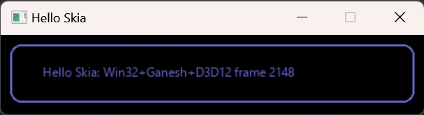

# HelloSkia

This project aims to contain minimal C++ examples on how to integrate Skia.

These examples are meant to contain as little code and as few abstractions as possible; they're not intended to be a demonstration of best practices for Skia or for other frameworks.

## Versions

This repository currently targets:

- C++20
- Skia m129

## 3D API notes

- Skia has two primary GPU abstractions: Ganesh (stable) and Graphite (beta)
- Ganesh supports OpenGL, D3D12, Metal, and Vulkan
- Graphite supports Metal, Vulkan, and Dawn
- Dawn is an implementation of WebGPU, and in turn supports D3D12, Metal, and Vulkan; D3D11 and OpenGL are in progress
- Ganesh's OpenGL support can be used in combination with ANGLE, which is an implementation of OpenGL ES. ANGLE in turn supports Direct3D 9, Direct3D 11, OpenGL, Vulkan, and Metal

This repostory currently includes examples for:

- Win32-Ganesh-D3D12

## Notes for Win32-Ganesh-D3D12



- Create the Skia context from your D3D12 device/queue with `GrDirectContext::makeDirect3D()`; `.fMemoryAllocator` in the input struct can be `nullptr`
- to import your swapchain buffers, with `SkSurfaces::WrapBackendRenderTarget()`
- the `SkSurface`s for the swapchain buffers should have their lifetime managed like the backing `ID3D12Resource`'s - i.e. you need to wait on fences etc before freeing them. Skia does not keep them alive for you
- Skia uses your command queue ,but uses its own internal command list
- if you want a resource barrier on completion - e.g. to `_PRESENT` - use `context->flush(pSurface, SkSurfaces::BackendSurfaceAccess::kPresent, flushInfo)` then `context->submit()` - `flushAndSubmit()`  does not support this. Otherwise you need to queue up another command list that waits on a fence for skia to finish, then transitions
- if you transition the resource outside of Skia (e.g. integrating with other D3D12 code), you need to call `SkSurfaces::GetBackendRenderTarget(pSurface, ...)` then call `setD3DResourceState(D3D12_RESOURCE_STATE_...)` on the return value. This *does not* transition the resource - it just tells Skia that you've done that elsewhere
- wrap ID3D12 fences in a `GrD3DFenceInfo`, then create a `GrBackendSemaphore` and call `initDirect3D`
- to signal a fence when Skia is done, add to the `GrFlushInfo` when calling `context->flush()`
- to wait on a fence (e.g. if using Skia to draw on top of other content), call `context->wait(...)`

## Building

```
git submodule update --init --recursive
```

You can then build like any other CMake project; for example, from a Visual Studio 'Developer Powertools Window':

```
Create-Directory build
cd build
cmake ..
cmake --build .. --config Debug --parallel
```
