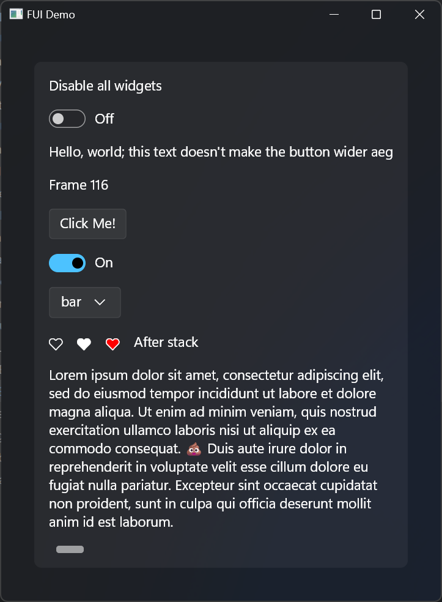

# FredEmmott::GUI

This is a work-in-progress, visually recreating WinUI3 using Skia, and an API that feels similar to immediate-mode GUI libraries. This library is **not** a true immediate-mode GUI.

While it is capable of rendering to texture for integration in other rendering pipelines, it is primarily intended for GUI app development.

You shouldn't use this (yet?).

## Example

See [`src/main.cpp`](src/main.cpp):

