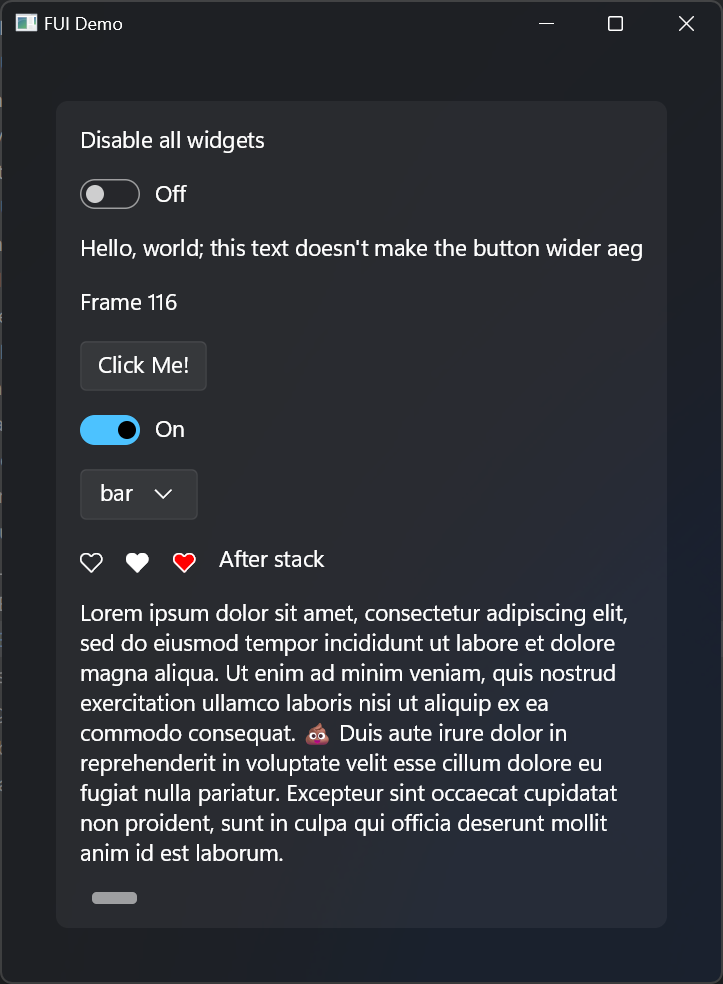

# FredEmmott::GUI

This is a work-in-progress, visually recreating WinUI3 using Skia, and an API that feels similar to immediate-mode GUI libraries. This library is **not** a true immediate-mode GUI.

While it is capable of rendering to texture for integration in other rendering pipelines, it is primarily intended for GUI app development.

While the API 'feels' immediate-mode, this is a wrapper over an internal retained-mode framework that provides features like:

- Layout inspired by CSS Flexbox ([Yoga](https://www.yogalayout.dev))
- Managed animations
- System APIs for international and emoji input
- 🚧 System APIs for accessibility (WIP)

You shouldn't use this (yet?).

## Example

See [`src/main.cpp`](src/main.cpp):



## Requirements

You shouldn't use this (yet?).

Only Windows is currently supported.

### Compiler requirements

- C++23
- source interpreted as UTF-8
  - on most compilers, this is the default
  - For MSVC, see [Microsoft's documentation](https://learn.microsoft.com/en-us/cpp/build/reference/utf-8-set-source-and-executable-character-sets-to-utf-8)

FUI has `static_assert()s` for these requirements

### Additional Windows requirements

- DPI awareness should be set to `DPI_AWARENESS_CONTEXT_PER_MONITOR_AWARE_V2`
- `RoInitialize()` or `winrt::init_aparment() must be called`; `CoInitializeEx()` *might* be sufficient, but is unsupported.
- Application must target Windows 10 or newer

The easiest way to meet these requirements is to:

- use `Win32Window::WinMain()` - this will automatically set up DPI awareness and call `RoInitialize()`, unless options are explicitly set to disable the behavior
- use a recent version of the Windows SDK
- make your build process set `-D_WIN32_WINNT=_WIN32_WINNT_WIN10` *and* `-DNTDDI_VERSION=NTDDI_WIN10`, or use the values for newer Windows versions.

The original Windows 10 version is currently targeted, but this is just because it's the oldest version that happens to provide all the features this library current uses. For my current needs, I only care about *consumer x64* versions of Windows 10 that *Microsoft currently support for all consumers* outside of extended service plans; if things work under any non-consumer versions - including LTSC - this is a happy accident. Future versions of this library may require a newer version of Windows, including v0.x and v1.x versions of this library.

### Additional Linux requirements

GCC 14+ (libstdc++-14 provides `std::ranges::to`).

The dependency lists below are long because most distros don't yet ship SDL3,
so vcpkg builds it from source. SDL3's `x11`, `wayland`, and `ibus` features
each need a handful of `*-devel`/`-dev` headers at SDL build time, and the
autoconf/automake/libtool chain comes in via SDL3 → dbus → libsystemd →
libxcrypt's autotools chain.

**Ubuntu 24.04 (Debian-family):**

```bash
sudo apt install \
  build-essential g++-14 git curl zip unzip tar pkg-config ninja-build cmake \
  autoconf autoconf-archive automake libtool-bin libltdl-dev \
  libicu-dev \
  libx11-dev libxft-dev libxext-dev libxkbcommon-dev libxrandr-dev libxi-dev libxcursor-dev libxtst-dev \
  libwayland-dev wayland-protocols libdecor-0-dev libegl1-mesa-dev \
  libibus-1.0-dev \
  libvulkan-dev vulkan-tools \
  libfontconfig1-dev libfreetype-dev \
  libharfbuzz-dev libdbus-1-dev \
  python3
```

**Fedora 43 (Red Hat-family):**

```bash
sudo dnf install \
  gcc gcc-c++ git curl zip unzip tar pkgconf-pkg-config ninja-build cmake \
  autoconf autoconf-archive automake libtool \
  libicu-devel \
  libX11-devel libXft-devel libXext-devel libxkbcommon-devel libXrandr-devel libXi-devel libXcursor-devel libXtst-devel \
  wayland-devel wayland-protocols-devel libdecor-devel mesa-libEGL-devel \
  ibus-devel \
  vulkan-loader-devel vulkan-tools \
  fontconfig-devel freetype-devel \
  harfbuzz-devel dbus-devel \
  python3
```

**Arch Linux:**

```bash
sudo pacman -S --needed \
  base-devel git curl zip unzip tar pkgconf ninja cmake \
  autoconf autoconf-archive automake libtool \
  icu \
  libx11 libxft libxext libxkbcommon libxrandr libxi libxcursor libxtst \
  wayland wayland-protocols libdecor mesa \
  ibus \
  vulkan-headers vulkan-icd-loader vulkan-tools \
  fontconfig freetype2 \
  harfbuzz dbus \
  python
```

#### Segoe UI fonts (recommended)

FUI's stock theme expects "Segoe UI Variable Text" / "Segoe Fluent Icons".
Without those installed, the runtime falls back to "Helvetica" → Skia's
internal default, which renders as generic sans-serif and lacks the icon
glyphs (FontIcon characters render as empty boxes; Debug builds also trip
a `FUI_ASSERT` because the missing-glyph width doesn't match the font
size). Install Microsoft's Segoe UI family on Linux via a community
repackage:

```bash
git clone https://github.com/mrbvrz/segoe-ui-linux
cd segoe-ui-linux
chmod +x install.sh
./install.sh
```

Then `fc-cache -fv` if `install.sh` doesn't already do it. Verify with
`fc-match "Segoe UI Variable Text"`.

#### Building the demo

The repo ships a `build.sh` wrapper that bootstraps vcpkg, configures a
CMake preset, and builds in parallel. The build directory is derived
from the preset name so different presets do not stomp each other.

```bash
./build.sh                          # default preset: "Linux - Skia - Debug"
./build.sh "Linux - Skia - Debug"   # -> build-linux-skia/
./build.sh "Linux - Skia - Release" # -> build-linux-skia-release/
```

The demo binary lands at `<build-dir>/src/fui-demo`.

## AI Usage

I've used LLMS (primarily Gemini 3 Flash) for:

- analysis of WinUI3 animations: the WinUI3 source tree includes C++ generated from Lottie files, but not the actual Lottie/Illustrator files. Gemini was great at providing a human-readable explanation of these machine-readable files, which I then implemented with Direct2D/Skia primitives.
- code review
- bug investigation
- semantic find/replace